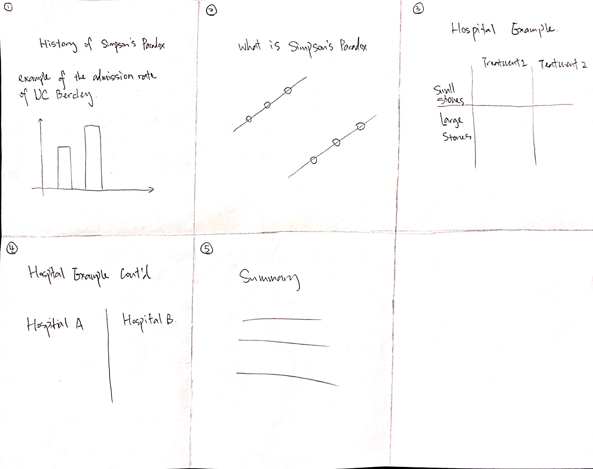

# Storytelling
## Slideshow

### Visual Narrative

* Close-Ups  

	> When presenting a complicated graph, having close-ups definitely helps viewers' understanding towards the content. Close-ups can also be used when we have some important information to present.
	
* Animated Transitions  
	
	> Having Animated Transitions gives readers a more fluent experience of viewing the website. The continuously animation grabs viewers attention as they scroll along the the website, which can potentially help their learning of the Simpson's Paradox.

### Narrative Structure

* Hover Highlighting / Details  

	> Hover highlighting presents additional information to the viewers besides what is on the graph. It also helps viewers better understand the graph with some more detailed information on hand.
* Captions / Headlines  
	> There are headlines on every graphs or visual aids. The headlines provide the way to communicate with the viewers. They also grab viewers' attention to potentially help them understand the content better.
* Summary / Synthesis  
	> There is a summary on the last slide. It provides the conclusion of the visual narration so that viewers can have an over view of what they have seen. It also helps to wrap up all the information presented in a dense paragraph for viewers to refer to later on. 
* Linear Ordering  
 	> Linear ordering the most common ordering system when telling a story, which is easy to follow and understand. It is also easy to have content that needs to be emphasized in the middle without confusing viewers.